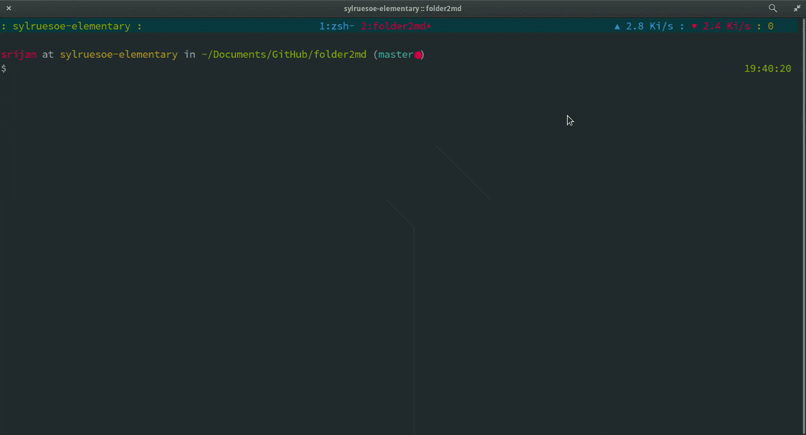

> Recursively convert a directory tree to markdown links

```
    ____      __    __         ___                 __
   / __/___  / /___/ /__  ____|__ \ ____ ___  ____/ /
  / /_/ __ \/ / __  / _ \/ ___/_/ // __ `__ \/ __  /
 / __/ /_/ / / /_/ /  __/ /  / __// / / / / / /_/ /
/_/  \____/_/\__,_/\___/_/  /____/_/ /_/ /_/\__,_/
```

## Install

- Copy the executable to $PATH.

## Usage

```shell
$ folder2md <folder-name>
```

## Demo



## License

MIT © [Srijan R Shetty](http://srijanshetty.in)
